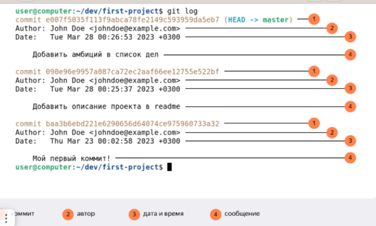

# Git

`pwd` выводит текущую рабочую директорию, которая необязательно является домашней

`cd ~` перейти к домашней директории

`ls` для отображения файлов и папок (содержимое директории)

`cd имя_папки` меняет текущую рабочую директорию на ту, которая указана в качестве параметра

`cd ..` переход на уровень выше

`cd .` обращение к текущей директории (code .)

`cd name_folder/name_folder2`/
`cd github/open-source-project` переместились сразу в папку open-source-project внутри github

`ls –a`
вывести расширенный список, отобразятся все скрытые файлы, которые начинаются с символа .

`ls ..`
покажет содержимое родительской директории

`ls ~`
выведет содержимое домашней директории

## Операции с папками и файлами: создание, копирование, перемещение

### Создание файлов/папок

`touch my-new-file.txt`
создать файл

`mkdir new-dir`
создать директорию

`mkdir -p dir1/dir-inside/dir-deeper-inside`
создали папку dir-deeper-inside в папке dir-inside, которая находится в папке dir1

`mkdir ~/my-project`
создаст папку my-project внутри домашней директории

`touch ../../file.txt`
создаст файл file.txt на две папки выше по иерархии
cp что_копируем куда_копируем

### Копирование файлов – cp (copy)

`cp что_копируем что_копируем что_копируем куда_копируем`

`touch first-project/data.txt first-project/table.csv`
Внутри папки first-project создать два файла: data.txt и table.csv

`cp data.txt ~`
скопировать файл в домашнюю директорию

### Перемещение файлов и папок – mv (move)

`mv table.csv ./very-important-files`
сначала указываем имя файла, который хотим переместить, потом путь — куда перемещаем

## Операции с папками и файлами: чтение и удаление

`cat` чтение файлов
`rm, rmdir, rm -r` удаление файлов и папок

### Удаление файлов и папок

Все команды удаления стирают данные безвозвратно — их нельзя будет восстановить из корзины!
`rm` удалить файл

`rm example.txt` удалили файл example.txt из текущей папки

`rmdir` удалить папку

`rmdir images` команда удалит папку images из текущей директории, если папка images пуста

`rm -r` рекурсивно удаляет файлы и папки

`rm -r images`
удалили папку images со всем её содержимым из текущей директории

## Эффективная работа с командной строкой

`&&` выполнить сразу несколько команд

`mkdir second-project && cd second-project && touch index.html style.css`
создаём папку second-project,<br>
переходим в папку second-project<br>
и создаём в ней два файла: index.html и style.css<br>

`↑ ↓` Вызывать команды из буфера
`Tab` Автозаполнение
`cd ~/[Tab]` вывели список директорий, чтобы понять, куда переходить

### Команды для быстрой навигации

`cd c:/ + Enter или
cd /c + Enter` попасть в корневую директорию Windows
`cd ~/Documents/` переместиться в домашнюю директорию
папка Documents хранится в домашней директории

# Установка Git

`git version`  
Если Git установлен правильно, консоль выведет его текущую версию

## Настройка Git

### Работа с файлом настройки .gitconfig

`$ git config --global user.name "User Namovich"`
 имя или ник нужно написать латиницей и в кавычках

`$ git config --global user.email username@yandex.ru` здесь нужно указать свой настоящий email

`cat ~/.gitconfig` или `git config --list`
вывести содержимое файла конфигурации Git

# Инициализируем репозиторий

`git init`
Сделать папку репозиторием

`rm -rf .git`
«Разгитить» папку, если что-то пошло не так

`git status`
Проверить состояние репозитория

## Добавляем файлы в репозиторий

`git add`
Подготовить файлы к сохранению

`git add --all`
Подготовить к сохранению все файлы в репозитории

`git add .`
Добавить текущую папку целиком

## Делаем первый коммит

`git commit`
Выполнить коммит

`git commit -m “your message”`
Выполнить коммит с сообщения

## Просматриваем историю коммитов

`git log`
Просмотреть историю коммитов

# Знакомство с GitHub

## Создаём удалённый репозиторий

## Что такое SSH

* SSH-ключ — ваш виртуальный идентификатор в GitHub. Как ключ от квартиры, он позволяет получить доступ к GitHub-репозиторию. Также SSH используется для доступа к другим удалённым серверам
* SSH — протокол, который обеспечивает безопасный обмен данными в сети и использует для этого ключи

## Генерируем SSH-ключ

`$ cd ~`  перешли в домашнюю директорию

`$ ls -la .ssh/` вывели список созданных ключей

## Проверка наличия SSH-ключа

## Инструкция по генерации SSH-ключа

`$ ssh-keygen -t ed25519 -C "электронная почта, к которой привязан ваш аккаунт на GitHub"`
ssh-keygen

`$ ssh-keygen -t rsa -b 4096 -C "электронная почта, к которой привязан ваш аккаунт на GitHub"`
ed25519

`> Generating public/private rsa key pair.` сгенерированы публичный и приватный ключи

`> Enter a file in which to save the key (C:\Users\<имя_пользователя>\.ssh\):[Press enter]`
Укажите место хранения ключей. Простой вариант — сделать домашний каталог пользователя путём по умолчанию

`> Enter passphrase (empty for no passphrase): [Type a passphrase]`

`> Enter same passphrase again: [Type passphrase again]`

Программа запросит кодовую фразу (англ. passphrase) для доступа к SSH-ключу. Вы можете оставить поле пустым. Для этого нажмите Enter, а затем ещё раз Enter для подтверждения.

`ls -a ~/.ssh`
проверить, что ключи действительно сгенерировались
два файла — один с расширением .pub, другой — без
.pub — публичный, им можно делиться с веб-сайтами или коллегами. Файл без расширения .pub — приватный. Ни в коем случае не передавайте его никому!

# Хеш — идентификатор коммита

## Хеш — основной идентификатор коммита

Git хранит таблицу соответствий `хеш → информация о коммите`. Если вы знаете хеш, вы можете узнать всё остальное: автора и дату коммита и содержимое закоммиченных файлов. Можно сказать, что хеш — основной идентификатор коммита.

При работе с Git хеши будут встречаться вам регулярно. Их можно будет передавать в качестве параметра разным Git-командам, чтобы указать, с каким коммитом нужно произвести то или иное действие.

Все хеши и таблицу `хеш → информация о коммите` Git сохраняет в служебные файлы. Они находятся в скрытой папке .git в репозитории проекта.

# Исследуем лог

Разберём элементы, из которых состоит описание:
* строка из цифр и латинских букв после слова commit — это хеш коммита;
* Author — имя автора и его электронная почта;
* Date — дата и время создания коммита;
* в конце находится сообщение коммита.

## Получить сокращённый лог — `git log --oneline`

Сокращённый хеш (то есть первые несколько символов полного) можно использовать точно так же, как и полный. Для этого команда `git log --oneline` автоматически подбирает такую длину сокращённых хешей, чтобы они были уникальными в пределах репозитория и Git всегда мог понять, о каком коммите идёт речь.

* Можно вызвать не только полный лог, но и сокращённый — это делается командой `git log --oneline.`
* В сокращённом логе выводятся сокращённые хеши — их можно использовать точно так же, как и полные.

# HEAD — всему голова `(HEAD -> master)`

## Файл HEAD

```
$ pwd # посмотрели, где мы
/Users/user/dev/first-project

$ cd .git/
$ ls # посмотрели, какие есть файлы
COMMIT_EDITMSG  ORIG_HEAD  description  index  logs/     refs/
HEAD            config     hooks/       info/  objects/

$ cat HEAD # команда cat показывает содержимое файла
ref: refs/heads/master # в файле вот такая ссылка 
```

```
$ cat refs/heads/master # взяли ссылку из файла HEAD
# внутри хеш
e007f5035f113f9abca78fe2149c593959da5eb7

$ git log 
# сверяем с хешем последнего коммита
commit e007f5035f113f9abca78fe2149c593959da5eb7
Author: John Doe <johndoe@example.com>
Date:   Tue Mar 28 00:26:53 2023 +0300

    Добавить амбиций в список дел

... # другие коммиты 
```

* В числе прочих файлов в папке .git есть служебный файл HEAD. Он указывает на самый свежий коммит.
* Вместо хеша последнего коммита можно написать слово HEAD — Git вас поймёт